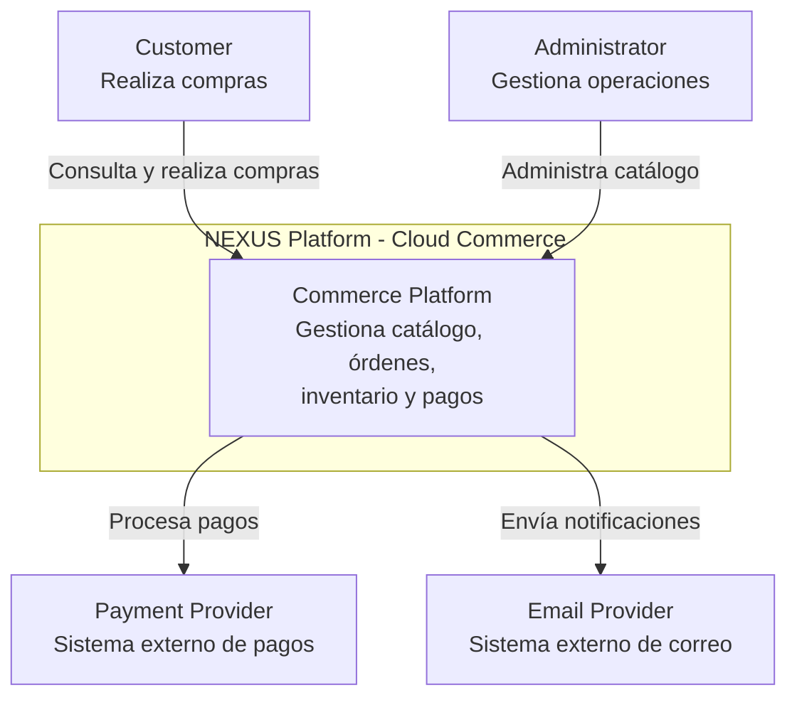

```mermaid
flowchart TB
customer["Customer<br/>Realiza compras"]
admin["Administrator<br/>Gestiona operaciones"]

    subgraph nexus["NEXUS Platform - Cloud Commerce"]
        platform["Commerce Platform<br/>Gestiona catálogo, órdenes,<br/>inventario y pagos"]
    end

    payment["Payment Provider<br/>Sistema externo de pagos"]
    email["Email Provider<br/>Sistema externo de correo"]

    customer -->|"Consulta y realiza compras"| platform
    admin -->|"Administra catálogo"| platform

    platform -->|"Procesa pagos"| payment
    platform -->|"Envía notificaciones"| email
```