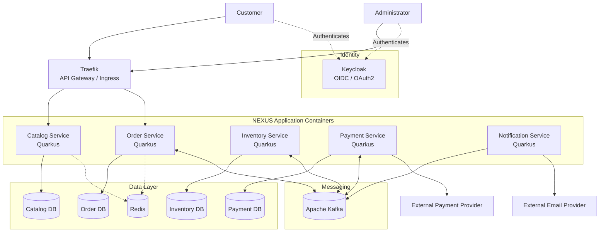

```mermaid

flowchart TB
    customer["Customer"]
    admin["Administrator"]

    gateway["Traefik<br/>API Gateway / Ingress"]

    subgraph identity["Identity"]
        keycloak["Keycloak<br/>OIDC / OAuth2"]
    end

    subgraph services["NEXUS Application Containers"]
        catalog["Catalog Service<br/>Quarkus"]
        order["Order Service<br/>Quarkus"]
        inventory["Inventory Service<br/>Quarkus"]
        payment["Payment Service<br/>Quarkus"]
        notification["Notification Service<br/>Quarkus"]
    end

    subgraph messaging["Messaging"]
        kafka[("Apache Kafka")]
    end

    subgraph persistence["Data Layer"]
        dbcatalog[("Catalog DB")]
        dborder[("Order DB")]
        dbinventory[("Inventory DB")]
        dbpayment[("Payment DB")]
        redis[("Redis")]
    end

    provider["External Payment Provider"]
    mail["External Email Provider"]

    customer --> gateway
    admin --> gateway

    gateway --> catalog
    gateway --> order

    customer -. "Authenticates" .-> keycloak
    admin -. "Authenticates" .-> keycloak

    catalog --> dbcatalog
    order --> dborder
    inventory --> dbinventory
    payment --> dbpayment

    catalog -.-> redis
    order -.-> redis

    order <--> kafka
    inventory <--> kafka
    payment <--> kafka
    notification --> kafka

    payment --> provider
    notification --> mail

```