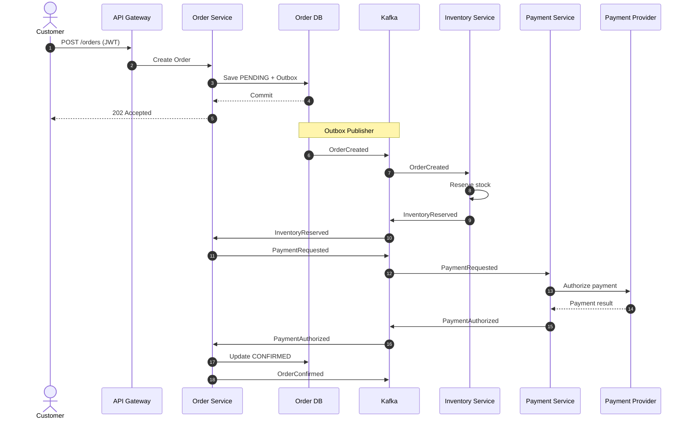

```mermaid

sequenceDiagram
    autonumber

    actor Customer
    participant Gateway as API Gateway
    participant Order as Order Service
    participant DB as Order DB
    participant Kafka
    participant Inventory as Inventory Service
    participant Payment as Payment Service
    participant Provider as Payment Provider

    Customer->>Gateway: POST /orders (JWT)
    Gateway->>Order: Create Order
    Order->>DB: Save PENDING + Outbox
    DB-->>Order: Commit
    Order-->>Customer: 202 Accepted

    Note over DB,Kafka: Outbox Publisher

    DB->>Kafka: OrderCreated

    Kafka->>Inventory: OrderCreated
    Inventory->>Inventory: Reserve stock
    Inventory->>Kafka: InventoryReserved

    Kafka->>Order: InventoryReserved
    Order->>Kafka: PaymentRequested

    Kafka->>Payment: PaymentRequested
    Payment->>Provider: Authorize payment
    Provider-->>Payment: Payment result
    Payment->>Kafka: PaymentAuthorized

    Kafka->>Order: PaymentAuthorized
    Order->>DB: Update CONFIRMED
    Order->>Kafka: OrderConfirmed

```